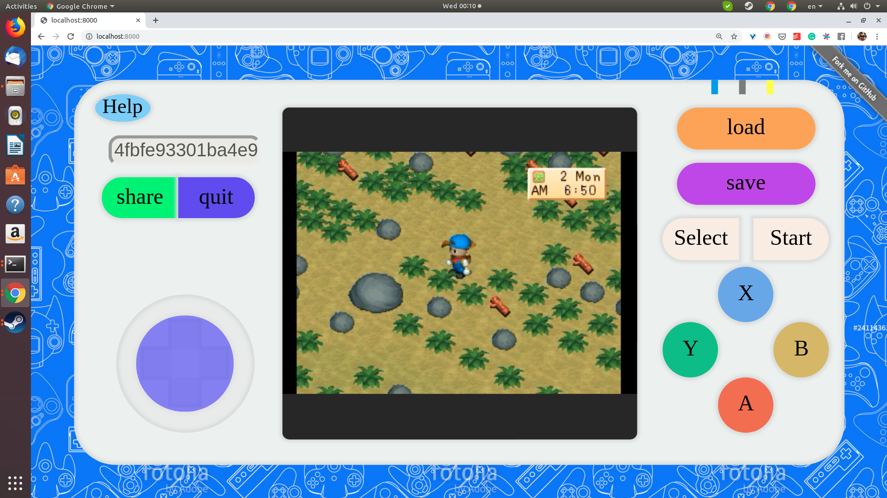

# CloudRetro
**Open-source Cloud Gaming Service For Retro Games**  
**Video demo**: https://www.youtube.com/watch?v=GUBrJGAxZZg

## Introduction
This project aims to experiment Cloud-gaming performance with [WebRTC](https://github.com/pion/webrtc/) and [libretro](https://www.libretro.com/), as well as trying to deliver the most modern and convenient gaming experience through the technology. Theoretically, games are run on remote servers and media are streamed to the player in an optimal way to ensure the most comfortable user interaction. It opens the ability to play any retro games on web-browser directly, which are fully compatible with multi-platform like Desktop, Android, ~~IOS~~. This flexibility also enables online gaming experience to retro games.  

## Try the service at
**[http://cloudretro.io](http://cloudretro.io)**  
*Chrome and Chrome on Android is recommended. It's not working on Iphone and some other explorers. Click help button in the game UI to see keyboard mapping.*  

\*In ideal network condition and less resource contention on servers, the game will run smoothly as in the video demo. Because I only hosted the platform on a limited servers in US East, US West, Eu, Singapore, you may experience some latency issues + connection problem. Please retry later in less peak hours. You can try hosting your own service following the instruction the next section to have a better sense of performance.  

Screenshot | Screenshot
:-------------------------:|:-------------------------:
|
|

## Feature
1. Cloud gaming: Game logic and storage is hosted on cloud service. It reduces the cumbersome of game initialization. Images and audio are streamed to user in the most optimal way using advanced encoding technology.
2. Cross-platform compatibility: The game is run on web browser, the most universal built-in app. No console, plugin, external app or devices are needed. Chrome with the latest version and fully WebRTC support is recommended for the game. 
3. Emulator agnostic: The game can be played directly without any extra effort to set up the gaming emulator or platform.
4. Vertically scaled: The infrastructure is designed to be able to scale under high traffic by adding more instances.
5. Cloud storage: Game state is storing on online storage, so you can come back and continue playing your incomplete game later.
6. Online multiplayer: Bring online multiplayer gaming to retro games. (In Road map)
7. Collaborate gameplay: Follow the idea of "Twitch Plays Pokemon", multiple players can play the same game together (In Road map)

## Run on local by Docker

You try running the server directly by `make dev.run-docker`. It will spawn a docker environment and you can access the service on `localhost:8000`.  

## Development environment

Install Golang https://golang.org/doc/install . Because the project uses GoModule, so it requires Go1.11 version.

Install dependencies  

  * Install [libvpx](https://www.webmproject.org/code/), [libopus](http://opus-codec.org/), [pkg-config](https://www.freedesktop.org/wiki/Software/pkg-config/)
```
# Ubuntu
apt-get install -y pkg-config libvpx-dev libopus-dev libopusfile-dev

# MacOS
brew install libvpx pkg-config opus opusfile

# Windows
... not tested yet ...
```

Because coordinator and workers needs to run simulateneously. Workers connects to coordinator.
1. Script
  * `make dev.run`
  * The scripts spawns 2 processes one in background and one in foreground
2. Manual
  * Need to run coordinator and worker separately in two session
  * `go run cmd/overlord/main.go` - spawn coordinator
  * `go run cmd/overworker/main.go --overlordhost ws://localhost:8000/wso` - spawn workers connecting to coordinator

## Wiki
- [Wiki](https://github.com/giongto35/cloud-game/wiki)

## FAQ
- [FAQ](https://github.com/giongto35/cloud-game/wiki/FAQ)  

## Credits

* *Pion* Webrtc team for the incredible Golang Webrtc library and their supports https://github.com/pion/webrtc/.  
* *libretro/kivutar* Golang libretro https://github.com/libretro/go-nanoarch and https://www.libretro.com/.  
* *gen2brain* for the h264 go encoder https://github.com/gen2brain/x264-go
* *poi5305* for the video encoding https://github.com/poi5305/go-yuv2webRTC.  
* *fogleman* for the NES emulator https://github.com/fogleman/nes.  
* And last but not least, my longtime friend Tri as the co-author. 

## Contributor

Nguyen Huu Thanh  
https://www.linkedin.com/in/huuthanhnguyen/  

Tri Dang Minh  
https://trich.im  

