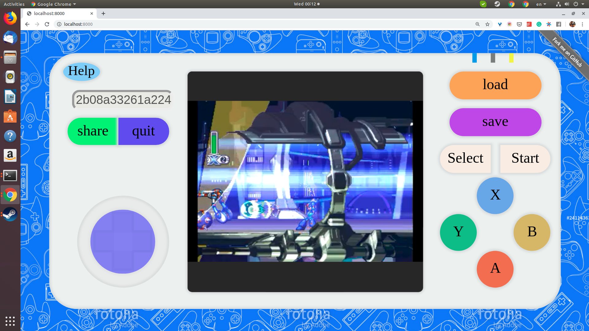
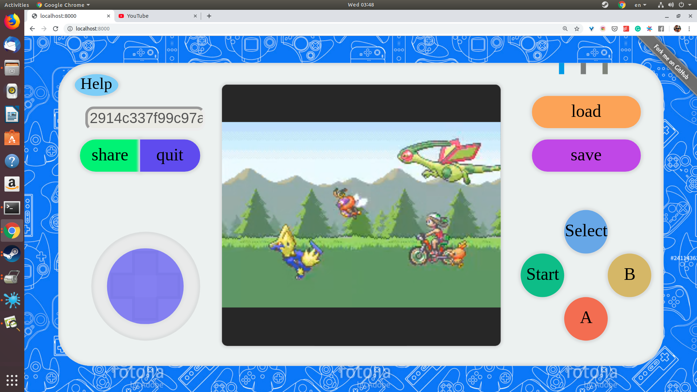
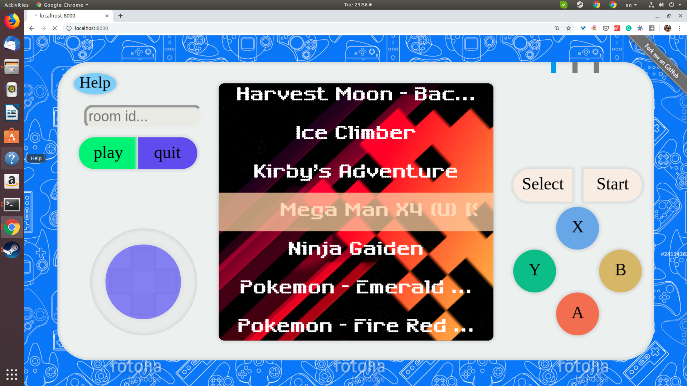

# CloudRetro
**Open-source Cloud Gaming Service For Retro Games**  
**Video demo**: https://www.youtube.com/watch?v=GUBrJGAxZZg

## Introduction
This project aims to experiment Cloud-gaming performance with [WebRTC](https://github.com/pion/webrtc/) and [libretro](https://www.libretro.com/), as well as trying to deliver the most modern and convenient gaming experience through the technology. 

Theoretically, in cloud gaming, games are run on remote servers and media are streamed to the player optimally to ensure the most comfortable user interaction. It opens the ability to play any retro games on web-browser directly, which are fully compatible with multi-platform like Desktop, Android, ~~IOS~~. It enhances crowdplay ([TwitchPlaysPokemon](https://en.wikipedia.org/wiki/Twitch_Plays_Pok%C3%A9mon)) with realtime interaction. E.g: [Play Pokemon Emerald together](http://cloudretro.io/?id=652e45d78d2b91cd%7CPokemon%20-%20Emerald%20Version%20%28U%29).  

## Try the service at
**[http://cloudretro.io](http://cloudretro.io)**
**[Play Pokemon Emerald together](http://cloudretro.io/?id=652e45d78d2b91cd%7CPokemon%20-%20Emerald%20Version%20%28U%29).**
*Chrome and Chrome on Android is recommended. It's not working on iPhone and some other explorers. Click help button in the game UI to see keyboard mapping.*  

\*In ideal network condition and less resource contention on servers, the game will run smoothly as in the video demo. Because I only hosted the platform on limited servers in US East, US West, Eu, Singapore, you may experience some latency issues + connection problem. You can try hosting the service following the instruction the next section to have a better sense of performance.  

|                   Screenshot                   |                   Screenshot                   |
| :--------------------------------------------: | :--------------------------------------------: |
|  |  |
|     |  |

## Feature
1. Cloud gaming: Game logic and storage is hosted on cloud service. It reduces the cumbersome of game initialization. Images and audio are streamed to user in the most optimal way using advanced encoding technology.
2. Cross-platform compatibility: The game is run on web browser, the most universal built-in app. No console, plugin, external app or devices are needed. Chrome with the latest version and fully WebRTC support is recommended for the game. 
3. Emulator agnostic: The game can be played directly without any extra effort to set up the gaming emulator or platform.
4. Collaborate gameplay: Follow the idea of crowdplay([TwitchPlaysPokemon](https://en.wikipedia.org/wiki/Twitch_Plays_Pok%C3%A9mon)), multiple players can play the same game together by addressing the same deeplink. The game experience is powered by cloud-gaming, so the game is much smoother. [Check CrowdPlay section](#crowd-play-play-game-together)
5. Vertically scaled: The infrastructure is designed to be able to scale under high traffic by adding more instances.
6. Cloud storage: Game state is storing on online storage, so you can come back and continue playing your incomplete game later.
7. Online multiplayer: 2nd, 3rd player can join the same game in the same room.

## Run on local by Docker

You try running the server directly by `make dev.run-docker`. It will spawn a docker environment and you can access the service on `localhost:8000`.  

## Development environment

Install Golang https://golang.org/doc/install . Because the project uses GoModule, so it requires Go1.11 version.

### (Window only) Extra setup
Setup MSYS2 (MinGW) environment if you are using Windows:
  * Please refer to the Libretro [doc](https://docs.libretro.com/development/retroarch/compilation/windows/#environment-configuration) for initial environment setup
  * Add Golang installation path into your .bashrc
    ```
    $ echo 'export PATH=/c/Go/bin:$PATH' >> ~/.bashrc
    ```
  * Install dependencies as described down bellow
  * Copy required [Libretro Core DLLs](http://buildbot.libretro.com/nightly/windows/x86_64/latest/) into the `cloud-game\assets\emulator\libretro\cores` folder and replace existing Linux SOs in the `cloud-game\pkg\config\config.go` EmulatorConfig object.
  * Use `C:\msys64\mingw64.exe` for building
  * To run the app use either MinGw terminal or copy: libdl.dll, libogg-0.dll, libopenal-1.dll, libopus-0.dll, libopusfile-0.dll, libvpx-1.dll
    files from `C:\msys64\mingw64\bin` into the `./bin` folder and then run.

### (All) Install Dependencies

  * Install [libvpx](https://www.webmproject.org/code/), [libopus](http://opus-codec.org/), [pkg-config](https://www.freedesktop.org/wiki/Software/pkg-config/)
```
# Ubuntu
apt-get install -y pkg-config libvpx-dev libopus-dev libopusfile-dev

# MacOS
brew install libvpx pkg-config opus opusfile

# Windows (MSYS2)
pacman -S --noconfirm --needed git make mingw-w64-x86_64-toolchain mingw-w64-x86_64-pkg-config mingw-w64-x86_64-dlfcn mingw-w64-x86_64-libvpx mingw-w64-x86_64-opusfile
```

Because the coordinator and workers need to run simultaneously. Workers connect to the coordinator.
1. Script
  * `make dev.run`
  * The scripts spawns 2 processes one in the background and one in foreground
2. Manual
  * Need to run coordinator and worker separately in two session
  * `go run cmd/overlord/main.go` - spawn coordinator
  * `go run cmd/overworker/main.go --overlordhost ws://localhost:8000/wso` - spawn workers connecting to coordinator

## Wiki
- [Wiki](https://github.com/giongto35/cloud-game/wiki)

## FAQ
- [FAQ](https://github.com/giongto35/cloud-game/wiki/FAQ)  

## Crowd Play, play game together
By clicking these deep link, you can join the game directly and play it together with other people.  
- [Play Pokemon Emerald](http://cloudretro.io/?id=652e45d78d2b91cd%7CPokemon%20-%20Emerald%20Version%20%28U%29) 
- [Fire Emblem](http://cloudretro.io/?id=314ea4d7f9c94d25___Fire%20Emblem%20%28U%29%20%5B%21%5D)
- [Advance War](http://cloudretro.io/?id=10fe582a7635b039___Advance%20Wars%20%28USA%29)
- [Harvest Moon](http://cloudretro.io/?id=3f7462269e976303___Harvest%20Moon%20-%20Back%20to%20Nature%20%28USA%29)
- [Play Pokemon Fire Red](http://cloudretro.io/?id=68bf168be6728020___Pokemon%20-%20Fire%20Red%20Version%20%28U%29%20%28V1.1%29) 
- [Mario](http://cloudretro.io/?id=1953c570fee1f9e4___Super%20Mario%20Bros) 

And you can host the new game by yourself by accessing [cloudretro.io](http://cloudretro.io) and click "share" button to generate a deeplink to your current game.

## Contribution
- The project cannot be possible without the contribution with those amazing people:
- [sadlil](https://github.com/sadlil) for massive code structure reogranization; log and monitor server introduction.
- [sergystepanov](https://github.com/sergystepanov/) for Audio re-implementation; bilinear, nearest neighbor interpolation scaling; Window setup document.

## Credits

* *Pion* Webrtc team for the incredible Golang Webrtc library and their supports https://github.com/pion/webrtc/.  
* *libretro/kivutar* Golang libretro https://github.com/libretro/go-nanoarch and https://www.libretro.com/.  
* *gen2brain* for the h264 go encoder https://github.com/gen2brain/x264-go
* *poi5305* for the video encoding https://github.com/poi5305/go-yuv2webRTC.  
* *fogleman* for the NES emulator https://github.com/fogleman/nes.  

## Author

Nguyen Huu Thanh  
https://www.linkedin.com/in/huuthanhnguyen/  

Tri Dang Minh  
https://trich.im  

